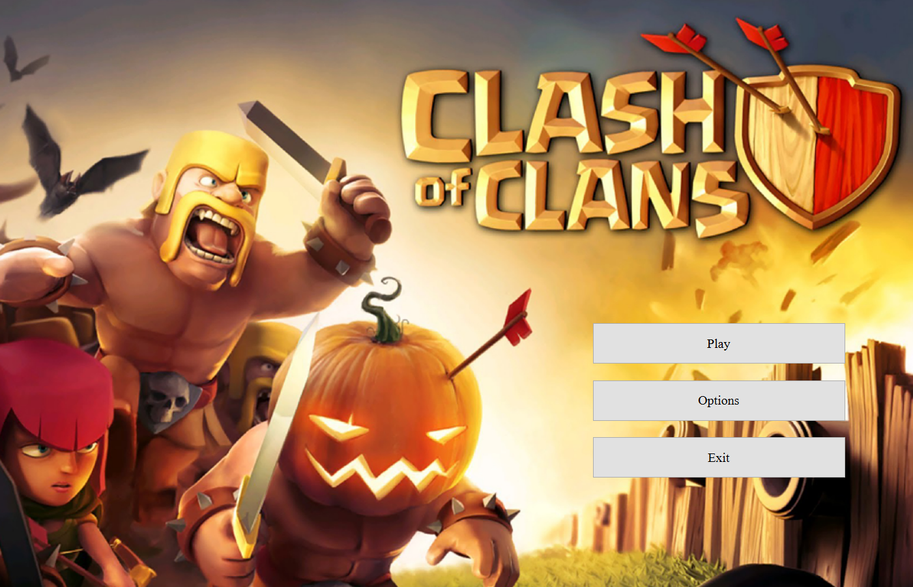
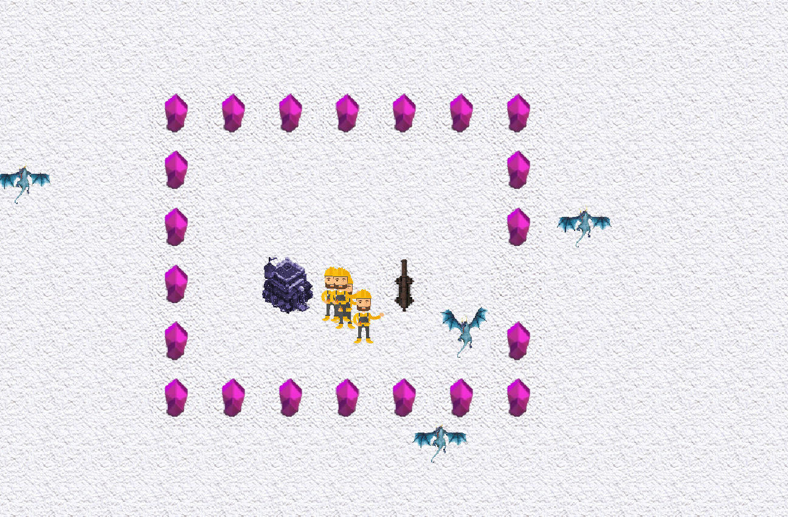
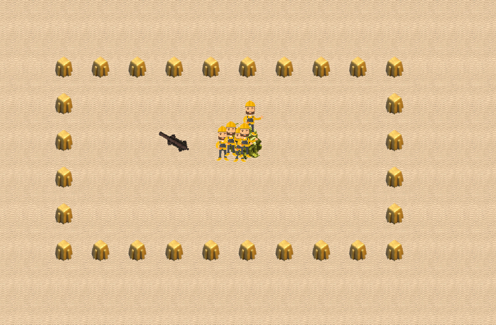

# 🏰 Mini Clash of Clans – Tower Defense Game

A fully interactive **strategy game** inspired by *Clash of Clans- Tower defense*, built using **C++ and the Qt framework**. This project captures the core mechanics of troop deployment, targeting, and combat logic with visual animations and a dynamic GUI.

---

## 🎮 Game Overview

In this game, players try to defeat enemy troops (dragons), who are fighting to destroy the castle and defenses. Troops troop apporaches the castle in the shortest path possible using dijkstra's algorithm.

---

## ✨ Key Features

- ✅ **Cannon** – Use the cannon to shoot enemy troops.
- ✅ **Citizen workers** – They fix the fence to defend against the incoming troops.
- ✅ **Varying difficulty** – In each level dragons deal more damage, move faster, and spawn  more
- ✅ **Animated Troops** – GIFs bring life to the units with idle and attack states.

---

## 🛠️ Technologies Used

- **Language:** C++  
- **Framework:** Qt (Widgets)  
- **Concepts:** Object-Oriented Programming, Inheritance, Polymorphism, Timers, Animation Handling  

---

## ▶️ How to Run

1. Download the game executable from this link:  
   👉 [Download Game EXE](https://drive.google.com/file/d/12-myWnOerPK7AUYkeo4761OpkJwtpKOC/view?usp=sharing)

2. Extract the folder

3. Double-click the `.exe` file to start playing — no installation needed.

---

## 📸 Screenshots

---

## 👨‍💻 Contributors

- Mahmoud Afifi  
- Yousef Elmenshawy  
- Koussay Jaballah

---
## Contact

For inquiries, contact Mahmoud Hossam at [mahmoudhossam@aucegypt.edu](mailto:mahmoudhossam@aucegypt.edu)
Contact Yousef Elmenshawy at [yousefelmenshawi@aucegypt.edu](mailto:yousefelmenshawi@aucegypt.edu)